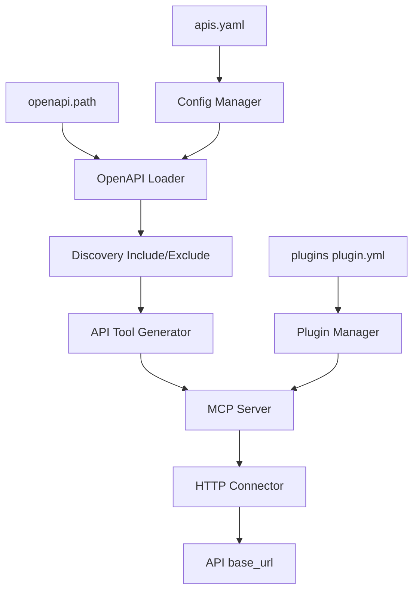

# HTTP API Plugin（OpenAPI → MCP Tool）

通过 `apis.yaml` 管理多个 HTTP API 服务，基于本地 OpenAPI 3.x 文档在启动时自动生成 MCP Tool，供 Claude Code、Codex 等 AI Agent 调用。

**实现状态：Phase 6 已落地**（`internal/openapi`、`internal/connector/http`、`list_apis`、`GET /api/apis`）。编码与行为以本文为准。

---

## 定位

| 概念 | 说明 |
|------|------|
| 资源 | `config/apis.yaml` 描述 API 服务：`endpoint`、`headers`、`labels`、`openapi.path` |
| 能力 | OpenAPI Operation 经 Discovery 过滤后生成 MCP Tool（**Go 原生**，不经 `plugin.yml` / Goja / `main.js`） |
| 清单 | 磁盘 Plugin `list_apis`（`target.type: config`）列出已配置 API 服务摘要 |

与磁盘 Plugin 的关系：

- MCP Tool 有两类来源：**磁盘 Plugin**（`plugins/**`）与 **OpenAPI 生成 Tool**。
- 二者统一出现在 `tools/list` / `tools/call` / `GET /api/tools`。
- Tool 名全局唯一；与磁盘 Plugin 或其它 API 的 `{prefix}{operationId}` 重名 → 启动或 `POST /api/reload` 失败，并**保留**上一份已加载集。



---

## apis.yaml

路径由 `ops-mcp.yaml` 的 `config.apis` 指定，默认 `./config/apis.yaml`。文件缺失视为空清单，**不**导致启动失败（与 `redis.yaml` 一致）。

### 完整示例

```yaml
apis:

  - name: cmdb
    description: CMDB API Service

    openapi:
      path: ./openapi/cmdb.yaml

    endpoint:
      base_url: http://cmdb-api:8080
      timeout: 10s
      verify_tls: true

    prefix: cmdb_

    labels:
      env: production
      system: cmdb
      location: beijing

    headers:
      Authorization: "Bearer ${CMDB_TOKEN}"

    discovery:

      include:

        - operation_ids:
            - "^get.*"
            - "^list.*"

        - methods:
            - GET
          paths:
            - "/internal/*"

      exclude:

        - methods:
            - POST
            - PUT
            - PATCH
            - DELETE

        - operation_ids:
            - "^delete.*"
            - "^update.*"
            - ".*Password.*"
            - ".*Token.*"

        - tags:
            - admin
            - internal

        - paths:
            - "/internal/debug/*"
```

仓库仅保留 [config/apis.yaml.example](../config/apis.yaml.example)；含真实 Token 的 `config/apis.yaml` 不得提交（见 `.gitignore`）。

示例文件附带 Prometheus / Loki / Flink 只读 OpenAPI 配置（文档在 `config/openapi/*-openapi.yaml`）；复制后按环境改 `endpoint.base_url` 即可。完整 discovery 字段示意见上方 CMDB 示例。

### 字段说明

| 键 | 类型 | 必填 | 说明 |
|----|------|------|------|
| `name` | string | 是 | API 服务唯一名称；禁止与清单内其它条目重名 |
| `description` | string | 否 | 服务描述（写入摘要与 `list_apis`） |
| `openapi.path` | string | 是 | 本地 OpenAPI 3.x / Swagger 文档路径（相对工作目录或绝对路径）；**仅支持本地文件**，离线可运行 |
| `endpoint.base_url` | string | 是 | 上游 API 根地址（不含具体 operation path） |
| `endpoint.timeout` | duration | 否 | 单次 HTTP 请求超时；缺省用全局 `defaults.plugin_timeout` |
| `endpoint.verify_tls` | bool | 否 | HTTPS 证书校验；缺省 `true` |
| `prefix` | string | 否 | 生成 MCP Tool 名时的前缀；缺省空字符串。例：`cmdb_` + `getHostById` → `cmdb_getHostById` |
| `labels` | map | 否 | 环境 / 业务系统 / 地域等标签 |
| `headers` | map[string]string | 否 | 固定 HTTP Header；支持 `${ENV_NAME}` 替换（见下节） |
| `discovery.include` | Rule[] | 否 | 纳入候选的规则；缺省或 `[]` 视为**全部 Operation** |
| `discovery.exclude` | Rule[] | 否 | 从候选中排除的规则；缺省或 `[]` 表示不排除 |

`name` 用于 ConfigManager 查找与管理 API 摘要；**Agent 调用的是生成后的 Tool 名**，不是 `apis.yaml` 的 `name`。

---

## 环境变量替换

以下字符串字段在加载配置时展开 `${ENV_NAME}`（与 shell 风格一致；未定义变量 → **加载失败**，错误信息含字段路径，如 `apis[cmdb].headers.Authorization`）：

| 字段 | 是否展开 |
|------|----------|
| `headers` 的每个 value | 是 |
| `endpoint.base_url` | 是 |
| `openapi.path` | 是 |
| 其它字段 | 否 |

示例：

```yaml
headers:
  Authorization: "Bearer ${CMDB_TOKEN}"
```

进程环境需预先设置 `CMDB_TOKEN`；勿把真实 Token 写入可提交文件或日志。

---

## OpenAPI 解析

启动（及 `config: true` 的 reload）时：

1. 读取 `apis.yaml`，按 `name` 建索引。
2. 对每个服务加载 `openapi.path` 指向的本地文件。
3. 解析 OpenAPI **3.x**（MVP 以 OpenAPI 3.0/3.1 YAML/JSON 为准；不支持仅远程 URL 拉取）。
4. 遍历 `paths` × HTTP method，提取：

| 字段 | 用途 |
|------|------|
| `operationId` | Tool 名后缀；**缺失则跳过该 Operation 并记 warn**，不自动编造名称 |
| `method` | GET / POST / PUT / PATCH / DELETE / HEAD / OPTIONS 等 |
| `path` | OpenAPI path 模板，如 `/host/{id}` |
| `tags` | Discovery 与描述辅助 |
| `summary` / `description` | Tool description |
| `parameters` | path / query / header（及 cookie，MVP 可忽略 cookie） |
| `requestBody` | 请求体 schema（见「MCP Tool 生成」） |

同一服务内 `operationId` 重复 → 该服务加载失败。跨服务或与磁盘 Plugin 的最终 Tool 名冲突 → 整体注册失败并保留旧集。

---

## Discovery 过滤

控制哪些 OpenAPI Operation 暴露为 MCP Tool。

### 公式

```text
Expose = Include AND NOT(Exclude)
```

语义：

1. **Include**：`discovery.include` 中**任意**一条 Rule 匹配 → 进入候选。  
   - `include` **缺省或 `[]`**：视为匹配**全部** Operation（便于只写 `exclude`）。
2. **Exclude**：`discovery.exclude` 中**任意**一条 Rule 匹配 → 从候选中排除。  
   - `exclude` 缺省或 `[]`：不排除。

最终暴露 = 候选 ∩ 未被 exclude 命中。

### Rule 结构

`include` / `exclude` 均为 Rule 数组。单条 Rule 可含零个或多个过滤字段：

| 字段 | 类型 | 匹配对象 |
|------|------|----------|
| `operation_ids` | string[] | `operationId`（按正则；见下） |
| `methods` | string[] | HTTP method（大小写不敏感） |
| `paths` | string[] | OpenAPI path（见「Path 匹配」） |
| `tags` | string[] | Operation 的 tag（精确字符串，大小写敏感） |

### Rule 内逻辑

- **不同字段之间：AND**  
  例：`methods: [GET]` 且 `paths: ["/host/*"]` → 必须同时满足。
- **同一字段多个值：OR**  
  例：`methods: [GET, HEAD]` → GET 或 HEAD；`operation_ids: ["^get.*", "^list.*"]` → 任一正则命中。
- Rule 未声明的字段不参与约束（视为对该维度恒真）。
- **空 Rule**（无任何过滤字段）：恒匹配（慎用）。

### operation_ids 匹配

`operation_ids` 中每一项按 **正则** 编译（建议写 `^get.*` 等形式）。非法正则 → 配置加载失败。

### 示例解读

上文 cmdb 示例：

- Include：`operationId` 匹配 `^get.*` / `^list.*` 的 Operation，**或**（method=GET 且 path 匹配 `/internal/*`）。
- Exclude：写方法、危险 `operationId`、`admin`/`internal` tag、以及 `/internal/debug/*`。
- 最终：满足 include 且未被 exclude 的 Operation 才生成 Tool。

---

## Matcher 设计（实现对照）

文档级接口（实现包建议 `internal/openapi` 或 `internal/apitool`）：

```go
type Operation struct {
    OperationID string
    Method      string
    Path        string
    Tags        []string
    // summary, description, parameters, requestBody, ...
}

type Matcher interface {
    Match(op *Operation) bool
}
```

| 类型 | 职责 |
|------|------|
| `OperationIDMatcher` | `operation_ids` 正则 OR |
| `MethodMatcher` | `methods` OR（大小写不敏感） |
| `PathMatcher` | `paths` OR（见 Path 匹配） |
| `TagMatcher` | `tags` OR（精确） |
| `RuleMatcher` | 上述子 Matcher 的 **AND**（仅对 Rule 中出现的字段建子 Matcher） |
| Discovery | `OR(include Rules)`（空 include → 恒真） **AND NOT** `OR(exclude Rules)`（空 exclude → 不排除） |

---

## Path 匹配

`paths` 规则字符串按以下优先级判定模式：

| 模式 | 判定条件 | 行为 |
|------|----------|------|
| Regex | 以 `^` 开头 | 整串按正则匹配 OpenAPI path |
| Glob | 不以 `^` 开头，且含未转义的 `*` 或 `?` | glob 匹配；`*` 可跨多段（如 `/internal/*`） |
| 模板 / 精确 | 其它 | 按路径段比较：字面量相等；任一侧段为 `{param}` 形式则该段视为通配单段 |

说明：

- OpenAPI 路径参数：`/host/{id}` 与规则 `/host/{id}` 或 `/host/123` 在模板规则下可对齐（单段）。
- 精确：`/api/v1/host` 仅匹配相同字符串（在无 `{param}` / glob / regex 时）。
- 非法正则 → 配置加载失败。

---

## MCP Tool 生成

### 命名与描述

| MCP 字段 | 来源 |
|----------|------|
| `name` | `{prefix}{operationId}`，例：`cmdb_getHostById` |
| `description` | 优先 `summary`；否则 `description`；再否则回退为 `method path` |

### inputSchema

由 OpenAPI `parameters` 与 `requestBody` 投影为 JSON Schema（`type: object`）：

| OpenAPI 来源 | Tool 入参 |
|--------------|-----------|
| path parameter | 同名属性；`required` 跟随 OpenAPI |
| query parameter | 同名属性 |
| header parameter | 同名属性（注意与配置 `headers` 的合并规则） |
| `requestBody` content `application/json` | 见下 |

**requestBody（MVP）：**

- 仅处理 `application/json`（或 `*/*` 且 schema 为 object 时按 JSON 处理）。
- 若 schema 为 **object**：将其 **properties 展开**到 Tool 入参根级（与 parameters 重名时：parameters 优先，body 属性跳过并 warn）；必填合并 `required`。
- 若 schema **非 object**（array / scalar）：入参增加单一属性 `body`，类型跟 schema。
- 其它 media type（如 `multipart/form-data`）：MVP **不生成**该 Operation 的 Tool，记 warn。

### 调用执行

`tools/call` 命中 OpenAPI Tool 时：

1. 按 Tool 绑定的 API `name` 取 `endpoint` / 配置 `headers`。
2. 用入参填充 path 模板、query、header。
3. Header 合并：**配置 `headers` 为底，入参中的 header 参数可覆盖同名键**。
4. 组装 JSON body（若有）→ HTTP Connector 请求 `base_url + path`。
5. 结果包装为统一 `{ "success": true, "data": ... }`；`data` 建议包含：

```json
{
  "status_code": 200,
  "headers": { "content-type": "application/json" },
  "body": {}
}
```

`body`：若响应为 JSON 则解析为对象/数组，否则为字符串。非 2xx 默认仍返回 `success: true` 与上述 `data`（由 Agent 判断）；连接级错误（DNS、TLS、超时）→ `success: false` / `CONNECTOR_ERROR`。

OpenAPI Tool **不经** Goja；超时取自该服务 `endpoint.timeout`（或全局默认）。

---

## 管理面与清单

| 入口 | 说明 |
|------|------|
| `GET /api/apis` | API 服务脱敏摘要（**不**回显 `headers` 原文）；见 [api.md](api.md) |
| `list_apis` | 磁盘 Plugin；`ctx.apis.list()`；字段与管理接口对齐 |
| `POST /api/reload` | `config: true` 时重载 `apis.yaml` 并**重建** OpenAPI Tools；`tools_count` = 磁盘 Plugin 数 + OpenAPI Tool 数 |

摘要字段建议：`name`、`description`、`labels`、`base_url`、`prefix`、`openapi_path`、`timeout`、`verify_tls`、`tool_count`（当前暴露的 Tool 数）、`has_headers`（bool，是否配置了 headers）。

---

## 安全

- 真实 Token / Cookie 仅存在于本地 `apis.yaml` 或环境变量；仓库只保留 `*.example`。
- 日志脱敏：不得打印 `Authorization`、`Cookie`、以及配置/入参中明显的密钥类 header 值。
- `verify_tls: false` 仅用于受控调试；生产保持 `true`。
- Discovery `exclude` 应覆盖写操作与敏感 Operation（密码、Token、admin tag 等）。
- MVP **不做** RBAC / Audit；能力边界 = 是否生成并加载对应 Tool。

---

## 与其它文档的关系

| 文档 | 内容 |
|------|------|
| [configuration.md](configuration.md) | `config.apis` 路径与 ConfigManager 行为摘要 |
| [architecture.md](architecture.md) | 分层与请求链路 |
| [connector.md](connector.md) | HTTP Connector 职责 |
| [plugin.md](plugin.md) | 双来源 Tool；`list_apis` |
| [runtime.md](runtime.md) | `ctx.apis.list`；`ctx.http.*`；OpenAPI Tool 不经 Goja |
| [api.md](api.md) | `GET /api/apis`、reload |
| [roadmap.md](roadmap.md) | Phase 6 交付与验收 |
| [user-guide.md](user-guide.md) | 部署与使用说明 |
