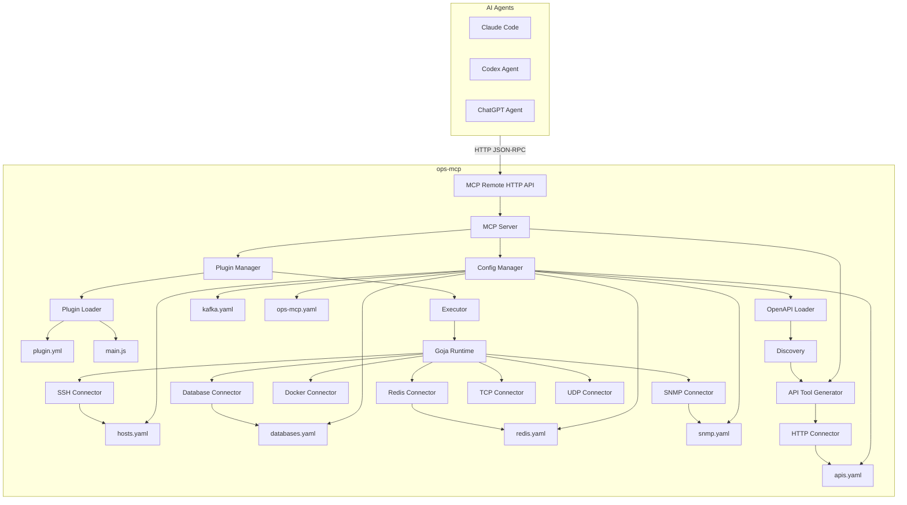
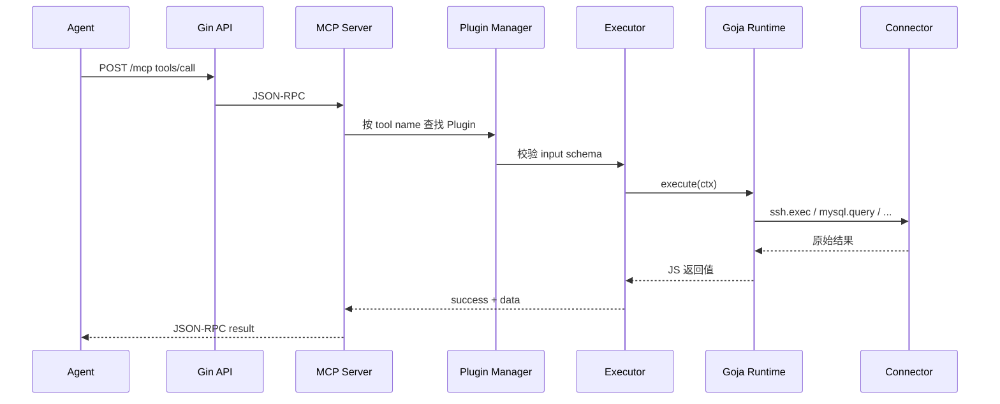
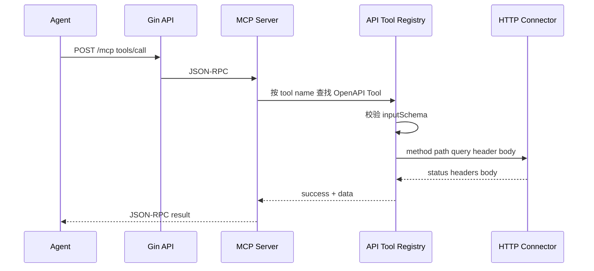

# 架构设计

## 定位

ops-mcp 是自研的 **Remote MCP Server**：对外提供 JSON-RPC over HTTP 的 MCP 端点，对内通过磁盘 Plugin + Goja 编排，或由 OpenAPI 自动生成的 Go 原生 Tool，经 Connector 访问 SSH、数据库、Docker、Redis 与 HTTP API 等资源。

## 总体架构



## 分层职责

| 层 | 包 | 职责 |
|----|------|------|
| API | `internal/api` | Gin 路由：`/mcp`、`/api/plugins`、`/api/tools`、`/api/databases`、`/api/redis`、`/api/kafka`、`/api/apis`、`/api/commands`、`/api/snmp`、`/api/reload`、`/health` |
| MCP | `internal/mcp` | JSON-RPC 处理、`initialize` / `tools/list` / `tools/call`；合并磁盘 Plugin 与 OpenAPI Tools |
| Plugin | `internal/plugin` | 扫描目录、解析 YAML、加载 JS、生命周期与热加载 |
| OpenAPI / API Tool | `internal/openapi`（或 `apitool`） | 解析本地 OpenAPI、Discovery、生成 Tool 元数据与执行绑定 |
| Runtime | `internal/runtime` | Goja 引擎、注入 `ctx`、超时与错误包装（仅磁盘 Plugin） |
| Executor | `internal/executor` | 参数校验 → 调 Runtime → 统一结果结构（磁盘 Plugin） |
| Connector | `internal/connector/*` | SSH / MySQL / PostgreSQL / Docker / Redis / Kafka / HTTP / Command / SNMP 实际 IO |
| Config | `internal/config` | Viper 加载与 ConfigManager |
| Model | `internal/model` | Plugin / Host / Database / Redis / Kafka / API / SNMP 等数据结构 |

## 设计原则

1. **能力即可见 Tool**  
   未加载的磁盘 Plugin、未通过 Discovery 暴露的 OpenAPI Operation，都不会出现在 MCP Tool 列表中，也不会被调用。

2. **Go 与 JS 分工**  
   - Go：MCP 协议、加载、YAML / OpenAPI 解析、参数校验、Runtime 管理、连接器、OpenAPI Tool 执行。  
   - JS：磁盘 Plugin 的参数处理、调用 Connector、组装返回值。  
   - OpenAPI 生成的 Tool **不经** Goja。

3. **配置与能力分离**  
   - 资源（主机、库、Redis、HTTP API）写在 `config/*.yaml`。  
   - 磁盘能力写在 `plugins/**`；HTTP API 能力由 OpenAPI + Discovery 生成。  
   - 通过资源名或生成 Tool 名引用，不硬编码地址与密钥。

4. **统一结果形态**  
   Tool / Plugin 执行结果统一为：

   ```json
   {
     "success": true,
     "data": {}
   }
   ```

   失败时 `success` 为 `false`，并携带错误信息（见 [api.md](api.md)）。

## 请求链路

### 磁盘 Plugin



步骤摘要：

1. Agent 对 `POST /mcp` 发起 `tools/call`，`name` 为 Plugin 名（如 `linux_ls`）。
2. MCP Server 向 Plugin Manager 解析对应 Plugin。
3. Executor 按 `plugin.yml` 的 `input` 校验参数。
4. Goja 执行 `main.js` 中的 `execute(ctx)`。
5. JS 通过 `ctx.ssh` / `ctx.mysql` / `ctx.redis` / `ctx.kafka` / `ctx.command` 等调用 Connector。
6. Connector 使用 ConfigManager 解析资源并执行（Command 解析本机白名单绝对路径）。
7. 结果包装为统一结构返回给 Agent。

### OpenAPI 生成 Tool



详见 [apis.md](apis.md)。

## 组件说明

### Plugin Manager

- 启动时扫描 `plugins/`（路径可由 `ops-mcp.yaml` 配置）。
- 每个子目录需同时包含 `plugin.yml` 与 `main.js`。
- 将 Plugin 注册为 MCP Tool（name / description / inputSchema）。
- 支持 `POST /api/reload` 热加载。

### API Tool Generator

- 读取 `apis.yaml`，加载本地 OpenAPI，应用 Discovery。
- 生成 Go 原生 MCP Tool（`{prefix}{operationId}`）。
- 与磁盘 Plugin 合并注册；重名失败并保留旧集。
- `config: true` 的 reload 时重建。

### Config Manager

启动时加载：

- `config/ops-mcp.yaml` — 服务监听、插件目录、日志等
- `config/hosts.yaml` — SSH 主机
- `config/databases.yaml` — 数据库连接
- `config/redis.yaml` — Redis 实例连接
- `config/kafka.yaml` — Kafka 集群连接
- `config/apis.yaml` — HTTP API 服务（OpenAPI 路径与 endpoint）
- `config/commands.yaml` — 本机可执行文件白名单（Command Connector）
- `config/snmp.yaml` — SNMP 设备与凭据（SNMP Connector）

向 Connector、Runtime 与 OpenAPI 加载器提供按 `name` 查找资源的能力。

### Goja Runtime

每次执行新建隔离 Goja VM，注入：

- `ctx.params`
- `ctx.hosts` / `ctx.databases` / `ctx.apis` / `ctx.commands`
- `ctx.ssh` / `ctx.mysql` / `ctx.postgres` / `ctx.docker` / `ctx.redis` / `ctx.kafka` / `ctx.http` / `ctx.command`

详见 [runtime.md](runtime.md)。OpenAPI Tool 不使用 Goja。

### Connector

统一由 Go 实现网络、协议与本机进程细节；JS 只传结构化参数。HTTP Connector 供 OpenAPI Tool 与磁盘 Plugin 使用；Command Connector 供本机 CLI 扩展（escape hatch）；SNMP Connector 供交换机等设备只读查询。详见 [connector.md](connector.md)。

## MVP 边界

| 纳入 MVP | 明确不做（本期） |
|----------|------------------|
| MCP Remote HTTP | RBAC / 用户系统 |
| Plugin + Goja + YAML | Permission 引擎 |
| OpenAPI → MCP Tool（Phase 6） | Audit 流水 |
| SSH / DB / Docker / Redis / HTTP / Command / SNMP Connector | allow_rules / deny_rules |
| Linux / Docker / DB / Redis / list_* / host_ping 等基础 Plugin | ops-mcp 自身的 Swagger UI |

能力边界由「是否存在并加载对应磁盘 Plugin 或 OpenAPI Tool」决定。

## 部署形态

- 单进程二进制 + 配置目录 + Plugin 目录（`make tar` 发行包 + `deploy/install.sh` systemd）。
- Docker 镜像：根目录 `Dockerfile`（`make docker` / `make docker-run`），目标平台 Linux amd64 / arm64。
- 开发：`make run` 读取 `./config/ops-mcp.yaml`。

详见 [user-guide.md](user-guide.md) 与 [deploy/README.md](../deploy/README.md)。
