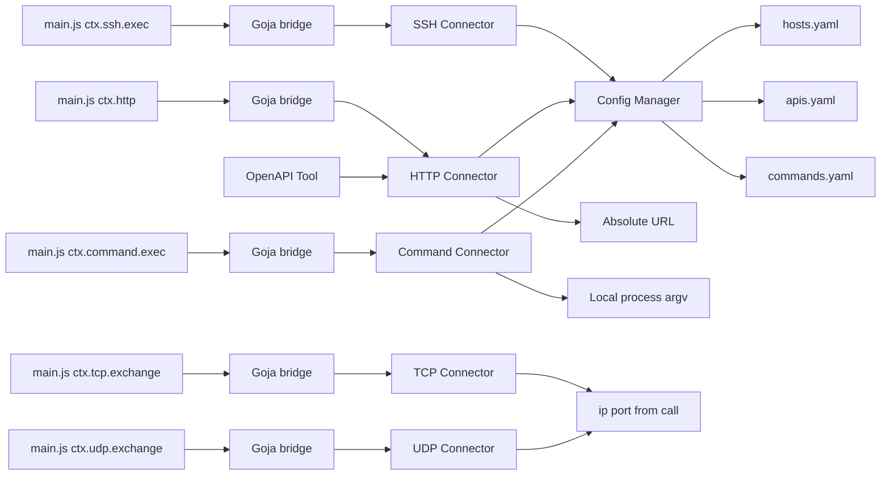

# Connector 设计

## 角色

Connector 是 Go 侧访问外部系统的唯一出口。Plugin 的 JavaScript 通过 Runtime 桥接调用 Connector，不直接持有连接细节。

## 实现约定

各 Connector 提供类型化方法（如 `Exec` / `Query` / `Ping`）；**不对 JS 暴露统一 `Execute` 入口**。Runtime 将 `ctx.*` 映射到对应方法。

对外契约以 [runtime.md](runtime.md) 的 `ctx.*` API 为准；本文件描述 Go 实现职责。

## 实现一览

| Connector | 包路径 | 主要能力 | 配置来源 |
|-----------|--------|----------|----------|
| SSH | `internal/connector/ssh` | 远程命令执行 | `hosts.yaml` |
| MySQL | `internal/connector/mysql` | SQL 查询 | `databases.yaml`（type=mysql） |
| PostgreSQL | `internal/connector/postgres` | SQL 查询 | `databases.yaml`（type=postgresql） |
| Docker | `internal/connector/docker` | `ps` / `logs` / `info` / `stats` / `inspect` / `top` / `history` | 经 SSH 在远端执行 `docker` CLI（`host` 必填） |
| Redis | `internal/connector/redis` | 只读运维查询（PING/INFO/SCAN 等） | `redis.yaml` |
| Kafka | `internal/connector/kafka` | 只读 Admin 查询（metadata / lag / config） | `kafka.yaml` |
| HTTP | `internal/connector/http` | 出站 HTTP（OpenAPI 生成 Tool） | `apis.yaml` |
| Command | `internal/connector/command` | 本机进程执行（Local Process Executor） | `commands.yaml`（二进制白名单） |
| SNMP | `internal/connector/snmp` | 只读 GET / WALK / BULKWALK（v2c / v3） | `snmp.yaml` |
| TCP | `internal/connector/tcp` | 单次请求-响应字节交换（`exchange`） | 调用方传 `ip`/`port`（无资源 YAML） |
| UDP | `internal/connector/udp` | 单次 datagram 请求-响应（`exchange`） | 调用方传 `ip`/`port`（无资源 YAML） |
| sqlguard / dbutil | `internal/connector/sqlguard`、`dbutil` | SQL 校验与查询结果共享逻辑 | — |
| netutil | `internal/connector/netutil` | TCP/UDP 载荷编解码与参数校验 | — |

## SSH Connector

### 职责

- 按 `host` 名称从 ConfigManager 解析主机。
- 支持 `password` 与 `private_key` 认证；密钥可用 `private_key`（PEM 或文件内容 base64）或 `private_key_file`（路径），互斥。
- 执行命令，收集 stdout / stderr / exit code。
- 尊重调用 `context.Context` 取消与超时。

### 请求 / 结果（与 JS 对齐）

**请求：** `host`、`command`、`args`、可选 `workdir` / `env`。

**结果：**

```json
{
  "stdout": "",
  "stderr": "",
  "exit_code": 0
}
```

非零 exit code 默认仍返回结果对象（由 Plugin / Agent 判断是否视为失败）；连接级错误（认证失败、网络不可达）返回 Go `error` → `CONNECTOR_ERROR`。

### 连接策略

- **按调用建连**，用完关闭（无连接池）。
- 私钥材料仅存于配置，不写入日志。

## Database Connector（MySQL / PostgreSQL）

### 职责

- 按 `database` 名称解析连接参数。
- 建立驱动连接（`go-sql-driver/mysql` / `lib/pq`）。
- 使用 `github.com/pingcap/parser` 做 SQL 语义分析，**仅允许单条 SELECT / UNION**。
- 按 `databases.yaml` 的 `limit`（默认 1000）包裹外层 `LIMIT`，防止大结果集拖垮数据库。
- 提供 `version`：查询服务器版本（`SELECT VERSION()` / `SELECT version()`）。
- 在日志中打印实际执行的 SQL（不含密码）。

### 请求 / 结果

**query 请求：** `database`、`sql`、可选 `args`。

**query 结果：**

```json
{
  "columns": ["..."],
  "rows": [],
  "row_count": 0
}
```

**version 请求：** `database`。

**version 结果：** `{ "version": "..." }`

MySQL 与 PostgreSQL 分两个包，但结果形态保持一致，便于 Plugin 与 Agent 处理。

## Docker Connector

### 职责

- 经 SSH 在目标主机执行 `docker` CLI（**`host` 必填**，对应 `hosts.yaml` 的 name）。
- 不提供默认本地 Docker / unix socket 路径。
- 提供容器列表、日志、info、stats、inspect、top、history 等只读查询。
- 不实现镜像构建、强制删除等高危写操作（除非后续增加独立 Plugin）。

### 方法映射

| JS | 行为 |
|----|------|
| `ctx.docker.ps` | 列出容器 |
| `ctx.docker.logs` | 读取指定容器日志 |
| `ctx.docker.info` | Docker 守护进程信息 |
| `ctx.docker.stats` | 容器资源占用（`--no-stream`） |
| `ctx.docker.inspect` | 容器 / 镜像详情 |
| `ctx.docker.top` | 容器内进程 |
| `ctx.docker.history` | 镜像层历史 |

## Redis Connector

### 职责

- 按 `redis` 名称从 `redis.yaml` 解析连接参数（支持无密码 / password / Redis 6+ ACL / TLS / mTLS）。
- TLS 材料字段为 `ca` / `cert` / `private_key`（PEM 或文件内容 base64）与对应 `*_file`（路径），内容与文件互斥。
- 使用 `github.com/redis/go-redis/v9` 建连；按调用建连，用完关闭；`tls.enabled` 时设置 `TLSConfig`（客户端证书即 mTLS）。
- 仅暴露只读运维查询方法（见 [runtime.md](runtime.md) `ctx.redis`）。
- 对可能产生大数据量的命令强制 `limit`/`count`（缺省上限 1000，见 `redis.yaml` 的 `limit`）。
- 日志记录命令与资源名，**不记录密码**。

### 安全兜底

| 能力 | 规则 |
|------|------|
| SCAN | `limit` 必填且 > 0；禁止 `KEYS` |
| SLOWLOG GET | `count` 必填且 > 0 |
| CLIENT LIST | `limit` 必填，超出截断 |
| ZRANGE sample | `limit` 必填，禁止全量导出 |
| CONFIG | 仅 GET，无 SET |
| GET | 仅 string key；非 string 类型返回 Connector 错误；缺失 key 时 `value` 为 null |
| LRANGE | `limit` 必填且 > 0；从 `start` 起最多返回 limit 个元素 |
| HGET / HMGET | 缺失 field 时 `value` 为 null；HMGET 的 `fields` 数量不得超过配置 `limit` |
| HSCAN | `limit` 必填且 > 0；禁止一次扫全表 |

### 请求约定

所有方法均需 `redis`（`redis.yaml` 中的 `name`）。涉及 key 的方法另需 `key`。

## Kafka Connector

### 职责

- 按 `kafka` 名称从 `kafka.yaml` 解析 bootstrap brokers（支持可选 SASL / TLS / mTLS）。
- 使用 `github.com/twmb/franz-go`（`kgo` + `kadm`）按调用建连，用完关闭。
- Go 侧统一入口：`Execute(ctx, action, params) (*Result, error)`；Runtime 将各 action 暴露为类型化 `ctx.kafka.*`（不对 JS 暴露裸 `Execute`）。
- 仅只读 Admin 查询（metadata、consumer lag、broker config 等）；不提供 produce / delete / alter。
- 列表类结果受 `kafka.yaml` 的 `limit`（缺省 1000）与请求 `limit` 截断。
- 日志记录 action 与资源名，**不记录密码**；broker config 的 sensitive 值返回 `[REDACTED]`。

### Execute actions

| action | 说明 | 额外必填 |
|--------|------|----------|
| `cluster_info` | cluster id / controller / brokers | — |
| `brokers` | broker 列表 | — |
| `topics` | topic 列表；可选 `prefix` / `limit` / `include_internal` | — |
| `topic_detail` | 分区 / 副本 / ISR | `topic` |
| `partition_health` | under-replicated / offline / no leader | 可选 `topic` |
| `consumer_groups` | group 列表；可选 `limit` | — |
| `consumer_lag` | 指定 group 分区 lag | `group`；可选 `topic` |
| `consumer_lag_summary` | 按 group 汇总 lag | 可选 `group` / `limit` |
| `topic_offsets` | earliest / latest offset | `topic` |
| `broker_config` | broker / 集群配置 | 可选 `broker_id` / `prefix` |

所有 action 均需 `kafka`（`kafka.yaml` 中的 `name`）。详见 [runtime.md](runtime.md) `ctx.kafka`。

## HTTP Connector

### 职责

支持两种寻址（互斥）：

1. **API 模式**：按服务 `name` 从 `apis.yaml` 取 `base_url` / 默认 `headers` / `timeout` / `verify_tls`，再拼 `path`。
2. **URL 模式**：调用方提供绝对 `http(s)` URL，不查 `apis.yaml`；可选本次 `timeout` / `verify_tls`。

共用行为：

- 发起出站 HTTP：method、query、header、可选 JSON body。
- 按调用建连（标准 `net/http` Client），尊重 `context.Context` 与超时。
- `verify_tls: false` 时跳过证书校验（仅调试）。
- 日志记录 method、URL、状态码与资源名；**脱敏** `Authorization` / `Cookie` 等敏感 header 值。

### 调用方

- **OpenAPI 生成 Tool**：MCP 层直接调用（API 模式），不经 Goja。见 [apis.md](apis.md)。
- **磁盘 Plugin**：经 Runtime 桥接 `ctx.http.request` / `get` / `post` / `put` / `patch` / `delete`（两种寻址均可）。见 [runtime.md](runtime.md)。

### 请求 / 结果（与 Tool data 对齐）

**请求（API 模式）：** `api`、`method`、`path`、`query`、`headers`、可选 `body`。  
**请求（URL 模式）：** `url`、`method`、`query`、`headers`、可选 `body` / `timeout` / `verify_tls`。

**结果：**

```json
{
  "status_code": 200,
  "headers": { "content-type": "application/json" },
  "body": {}
}
```

连接级错误（DNS、TLS、超时）→ `CONNECTOR_ERROR`。HTTP 非 2xx 由上层决定是否仍作为 `success: true` 的 `data` 返回（契约见 [apis.md](apis.md) / Plugin 自行判断）。

## Command Connector（Local Process Executor）

本机进程执行能力扩展点（escape hatch）：当尚无专用 Connector 时，通过磁盘 Plugin + 本机 CLI（如常见的 `ping`，或按需登记的其他工具）快速暴露 MCP Tool。

与 SSH 的分工：`ctx.ssh.exec` = **远端**主机；`ctx.command.exec` = **ops-mcp 进程所在主机**。

注意：`plugin.yml` 的 `type: command` 仅为 Tool 元数据标签，**不**等同于本 Connector；`target.type: command` 才表示意图使用本机 Command Connector。

### 职责

- 按逻辑 `command`（`commands.yaml` 的 `name`）从 ConfigManager 解析已解析的绝对路径 `path`。
- `commands.yaml` 的 `path` 为绝对路径数组（兼容单字符串）：加载 / reload 时按顺序取第一个本机存在且可执行的路径；全部不可用则跳过该 `name` 并打 warning。
- 使用 `os/exec.CommandContext` **无 shell** 执行：解析后的 `path` + `args` 原样作为 argv。
- 收集 stdout / stderr / exit code；尊重调用 `context.Context` 取消与超时（取消时尽量杀掉进程组，避免孤儿进程）。
- 对 stdout / stderr 做最大字节截断，防止超大输出拖垮进程。
- 日志记录逻辑名、解析后的 path、args 长度与 exit code；不把整段输出打进 info 日志。

### 双层安全边界

1. **配置白名单**：仅 `commands.yaml` 登记且本机解析到可用绝对路径的 `name` 可执行；未登记 / 无可用 path → `INVALID_PARAMS`。
2. **Plugin 即能力**：`main.js` 固定调用哪个 `name`、如何将 MCP `arguments` 映射为 `args`；未加载 Plugin = Agent 不可见。

MVP **不**解析子命令正则 / 全局 allow_rules；子命令约束由各 Plugin 自行固定（如只拼 `get pods`）。

### 请求 / 结果（与 JS 对齐）

**请求：** `command`（白名单逻辑名）、可选 `args` / `workdir` / `env`。

**结果：**

```json
{
  "stdout": "",
  "stderr": "",
  "exit_code": 0
}
```

非零 exit code 默认仍返回结果对象（由 Plugin / Agent 判断）；可执行文件不存在、无法启动、被信号杀死等 → `CONNECTOR_ERROR`；`command` 未登记 → `INVALID_PARAMS`。

### 调用约定

- **禁止**把任意文件系统路径或 shell 字符串当作 `command`；必须是 `commands.yaml` 的 `name`。
- **禁止**经 `sh -c` 拼接整段命令。
- 不提供「任意 argv 透传」的通用 MCP Tool；每个动作拆成独立 Plugin。

## SNMP Connector

### 职责

- 按 `device` 名称从 `snmp.yaml` 解析地址与认证（**credential 引用**或**设备内联 auth**，互斥）。
- 使用 `github.com/gosnmp/gosnmp` 发起 UDP SNMP；支持 **SNMPv2c** 与 **SNMPv3**（noAuthNoPriv / authNoPriv / authPriv）。
- 只读：`Get` / `Walk` / `BulkWalk`；**不做 SET**、不接收 TRAP。
- 按调用建连，用完关闭；全局并发信号量（默认 32）限制扇出。
- Walk/Bulk 强制 `walk_max_oids` 截断，结果带 `truncated`。
- 日志记录 device / oid，**不记录** community / auth_password / priv_password。

### 请求 / 结果（与 JS 对齐）

**get：** `device`、`oids`（字符串数组，单次最多 64）。  
**walk / bulk：** `device`、`oid`；可选 `max_oids` / `max_repetitions`（bulk）。

**结果：**

```json
{
  "device": "sw-dc1-core-01",
  "vars": [
    { "oid": "1.3.6.1.2.1.1.1.0", "type": "OctetString", "value": "..." }
  ],
  "truncated": false,
  "count": 1
}
```

`device` 不存在或 auth 无法解析 → `INVALID_PARAMS`；超时 / 拒绝 / 认证失败 → `CONNECTOR_ERROR`。

### 凭据解析

| 设备配置 | 行为 |
|----------|------|
| `credential: <name>` | 查 `credentials[]` |
| `auth: { ... }` | 使用内联块 |
| 两者都有 / 都无 | 加载 `snmp.yaml` 失败 |

---

## TCP / UDP Connector

### 职责

- 提供原始字节 **请求-响应** 交换（`exchange`），供磁盘 Plugin 对接私有设备协议（如 UDP 光保等）。
- **无** `net.yaml` / 命名 endpoint；每次调用必填 `ip` + `port`。
- 载荷：`data` 为 **hex 字符串** 或 **0–255 整数数组**；结果同时返回 `hex` 与 `bytes`。
- 缺省 `timeout=5s`、`max_response_bytes=65536`（硬上限 1 MiB）；请求字段可覆盖。
- TCP：dial → write →（半关闭写端）→ 读至 EOF / deadline / 上限 → close。  
- UDP：发一个 datagram，收一个响应包。
- Connector 层**无地址白名单**；能力边界由 Plugin 写法约束。
- 日志记 `ip:port` 与字节长度，**不**默认 dump 完整 payload。

### 请求 / 结果（与 JS 对齐）

**请求：** `ip`、`port`、`data`；可选 `timeout`、`max_response_bytes`。

**结果：**

```json
{
  "ip": "127.0.0.1",
  "port": 19090,
  "protocol": "tcp",
  "request_bytes": 4,
  "response_bytes": 4,
  "hex": "0102030a",
  "bytes": [1, 2, 3, 10],
  "rtt_ms": 3
}
```

非法 `ip`/`port`/`data`/`timeout` → `INVALID_PARAMS`；拨号 / 读写 / 超时 → `CONNECTOR_ERROR`。

### 使用建议

| 建议 | 说明 |
|------|------|
| **建议** | 在业务 Plugin 的 `main.js` 中**固定或校验** `ip`/`port`，MCP 只暴露业务参数 |
| **不建议** | 将 `ctx.params.ip` / `ctx.params.port` 原样透传给 `exchange`（等于把任意拨号权交给 Agent） |

仓库内 `tcp_exchange` / `udp_exchange` 仅为调试冒烟透传 Tool。本地联调：`make net-up`（见 [deploy/dev-net/README.md](../deploy/dev-net/README.md)）。

---

## 与 ConfigManager 的关系



除 **TCP / UDP** 外，Connector **禁止**在代码中硬编码主机地址或密码；必须通过资源 `name` 查找配置。Command Connector 通过逻辑 `name` 解析本机绝对路径，禁止 JS 传入任意 path。TCP/UDP 由调用传入 `ip`/`port`（**建议**在 Plugin 内限制目标，**不建议** MCP 参数透传任意地址）。

## 错误模型

| 情况 | 处理 |
|------|------|
| 资源 name 不存在 | 错误返回，文案含资源名 |
| 认证失败 | `CONNECTOR_ERROR`，不回显密码 |
| 超时 | 与 Plugin timeout / API `endpoint.timeout` / context 对齐 |
| 非 SELECT / 多语句 SQL | `INVALID_PARAMS`，拒绝执行 |
| Redis 缺少必填 limit/count | `INVALID_PARAMS`，拒绝执行 |
| HTTP 连接 / TLS 失败 | `CONNECTOR_ERROR`，不回显敏感 header |
| Command 白名单未登记 | `INVALID_PARAMS` |
| 本机进程无法启动 / 超时被杀 | `CONNECTOR_ERROR` |
| SNMP device / credential 无效 | `INVALID_PARAMS` |
| SNMP 超时 / 认证失败 | `CONNECTOR_ERROR`（不回显密钥） |
| TCP/UDP 非法 ip/port/data | `INVALID_PARAMS` |
| TCP/UDP 拨号 / 读写超时 | `CONNECTOR_ERROR` |

## 扩展新 Connector

1. 在 `internal/connector/<name>/` 实现 `Connector`。
2. 在 Runtime 注册 `ctx.<name>.*` 桥接（若需 JS 编排）；或如 HTTP 由 OpenAPI Tool 在 Go 侧直接调用。
3. 增加配置文件或扩展现有 YAML（如需要）。
4. 用磁盘 Plugin 或 OpenAPI 生成 Tool 暴露能力（无对应 Tool 则 Agent 不可见）。
5. 更新本文档与 [runtime.md](runtime.md)、[plugin.md](plugin.md)、必要时 [apis.md](apis.md)。

Command Connector（Phase 7）、SNMP Connector（Phase 8）与 TCP/UDP Connector（Phase 9）均为按上述流程扩展的范例。
